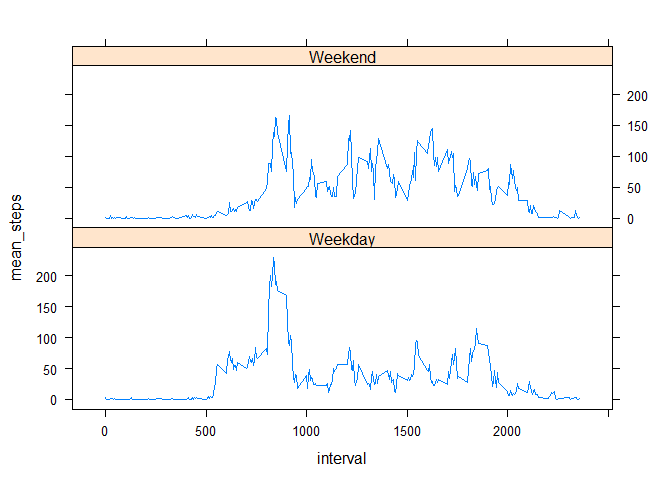

# Reproducible Research - Course Project 1
Lavanya Viswanathan  
April 10, 2017  

## Read the input data

This section reads the input data from csv:


```r
library(dplyr)
```

```
## 
## Attaching package: 'dplyr'
```

```
## The following objects are masked from 'package:stats':
## 
##     filter, lag
```

```
## The following objects are masked from 'package:base':
## 
##     intersect, setdiff, setequal, union
```

```r
library(lattice)
dataset <- read.csv("activity.csv")
data_wo_na <- dataset[!is.na(dataset$steps),]
```

## What are the mean and median of the total number of steps taken per day?

Plots a histogram of the total number of steps by day, and calculate the mean and median


```r
steps_by_day <- data_wo_na %>%
  group_by(date) %>%
  summarize(total_steps=sum(steps))
hist(steps_by_day$total_steps)
```

<!-- -->

```r
mean(steps_by_day$total_steps)
```

```
## [1] 10766.19
```

```r
median(steps_by_day$total_steps)
```

```
## [1] 10765
```

## What is the average daily activity pattern?

Makes a time series plot of the average activity per daily interval, and displays the maximum. Interval 835 contains the maximum average number of steps


```r
steps_by_interval <- data_wo_na %>%
  group_by(interval) %>%
  summarize(mean_steps = mean(steps))
plot(steps_by_interval$interval,steps_by_interval$mean_steps,type="l")
```

<!-- -->

```r
arrange(steps_by_interval,desc(mean_steps))
```

```
## # A tibble: 288 × 2
##    interval mean_steps
##       <int>      <dbl>
## 1       835   206.1698
## 2       840   195.9245
## 3       850   183.3962
## 4       845   179.5660
## 5       830   177.3019
## 6       820   171.1509
## 7       855   167.0189
## 8       815   157.5283
## 9       825   155.3962
## 10      900   143.4528
## # ... with 278 more rows
```

## Imputing missing values

First, calculate the total number of rows with NAs. It turns out that only the steps column has NAs. There are no NAs in either the date or interval columns.


```r
sum(is.na(dataset$steps)) + sum(is.na(dataset$date)) + sum(is.na(dataset$interval))
```

```
## [1] 2304
```

Then, fill the missing values with the average number of steps for the corresponding interval. We cannot fill with the average number of steps for a day because some days have only NA values in all intervals. So we fill in missing values with the average for the corresponding interval across all days.


```r
data_na <- dataset[is.na(dataset$steps),]
data_na_impute <- left_join(data_na,steps_by_interval,by="interval") %>%
  select(mean_steps,date,interval) %>%
  rename(steps = mean_steps)
```

Finally, concatenate the imputed data set with the original data set (without NAs). Plot a new histogram, and calculate the mean and median of the new data set. The mean is, as expected, the same as what we computed earlier, but the median is now higher.


```r
new_dataset <- rbind(data_wo_na,data_na_impute)
steps_by_day <- new_dataset %>%
  group_by(date) %>%
  summarize(total_steps=sum(steps))
hist(steps_by_day$total_steps)
```

<!-- -->

```r
mean(steps_by_day$total_steps)
```

```
## [1] 10766.19
```

```r
median(steps_by_day$total_steps)
```

```
## [1] 10766.19
```

## Are there differences in activity patterns between weekdays and weekends?

First create a column that specifies whether the date is a weekday or a weekend day. Then group the dataset to find the average number of steps in each interval on a weekday or weekend day. Finally, plot the data using lattice plot


```r
data_week <- new_dataset %>% mutate(weekday = weekdays(as.Date(date)))
data_week$week_factor <- as.factor(sapply(data_week$weekday,function(x) if(x == "Saturday" | x == "Sunday") "Weekend" else "Weekday"))
data_week <- data_week %>%
  group_by(week_factor,interval) %>%
  summarize(mean_steps = mean(steps))
xyplot(mean_steps ~ interval | week_factor,data=data_week,layout=c(1,2),type = "l")
```

<!-- -->
